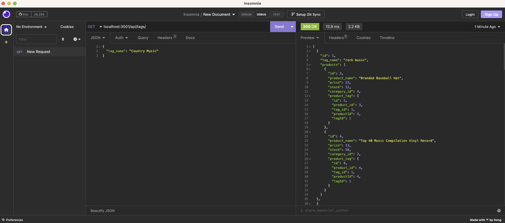

# Ecommerce Back End  

## Description
This project uses Express.js API and Sequelize to interact with a MySQL database.
## Screenshot

## Video Walkthrough
https://www.youtube.com/watch?v=gOqxvBcSJBA
## Table of Contents:
* [Installation](#installation)
* [Usage](#usage)
* [License](#license)
* [Contributing](#contributing)
* [Tests](#tests)
* [Questions](#questions)
### Installation:
This project uses the following dependencies:
```navigate to directory and run npm i, seed the database and open it in Insomniac.```
### Usage:
All usage allowed.
### License:
This project is licensed under:
MIT License
### Contributing:
All contributions welcome.
### Tests:
In order to test open the console and run the following:
```N/A```
### Questions:
If you have any questions contact me on [GitHub](https://github.com/adam42288) or email 
me at A75052@gmail.com  
 